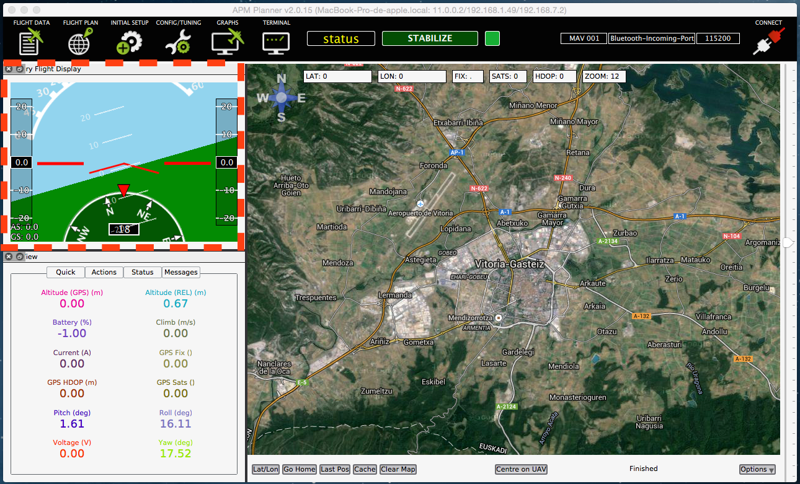
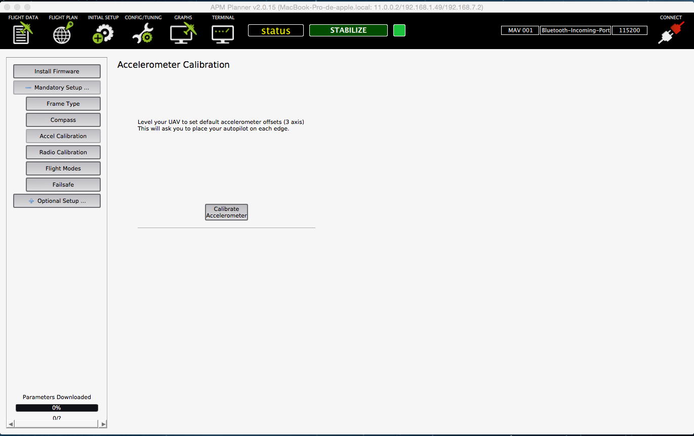
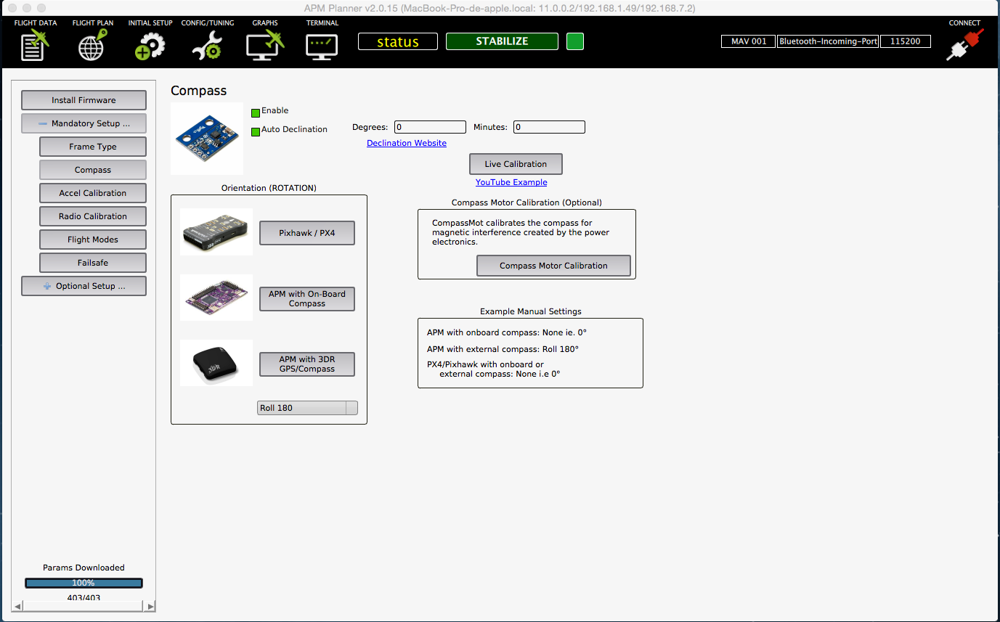
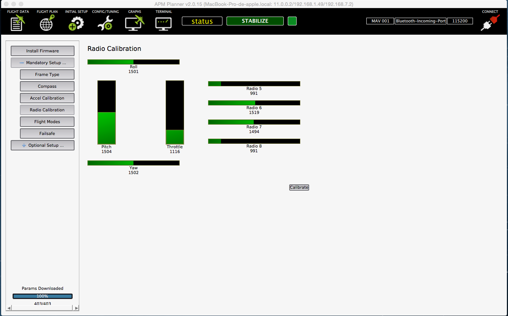
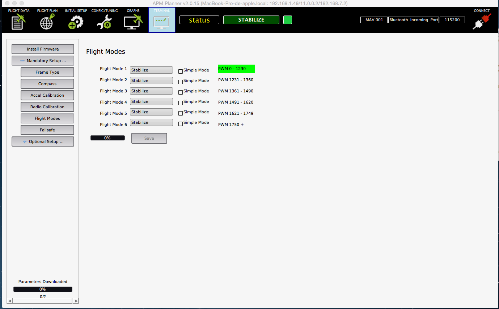
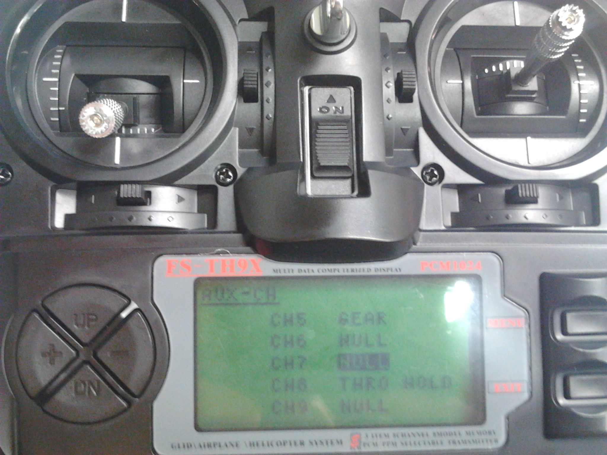
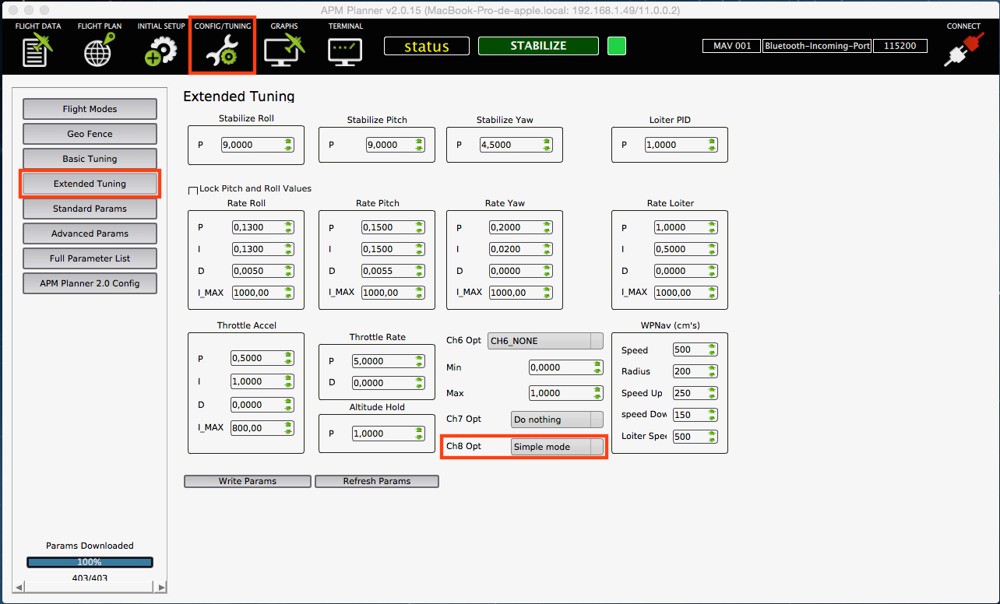

# APM Planner

[APM Planner](http://planner2.ardupilot.com/) 2.0 is an open-source ground station application for MAVlink based autopilots including [Erle-Robotics](http://erlerobotics.com) products that can be run on Windows, Mac OSX, and Linux.

######Content

* [Installation](#installation)
* [Connecting to Erle-Brain/Vehicles](#connecting-to-erle-brain)
* [APM Planner basics](#apm-planner-basics)
	* [Flight Data Display](#flight-data-display)
	* [Initial Setup](#initial-setup)
	* [External Compass](#external-compass)
	* [IMU calibration](#imu-calibration)
	* [Radio Calibration](#radio-calibration)
	* [Flight Modes](#flight-modes)
* [Adding Simple Mode](#adding-simple-mode) 
	* [Normal mode vs Simple mode](#normal-mode-vs-simple-mode)
	* [Configuring Simple Mode](#configuring-simple-mode)

###Installation

You can download APM Planner in the next links:

* [Linux](http://planner2.ardupilot.com/wiki/installation-for-linux/)
* [Windows](http://planner2.ardupilot.com/wiki/install-windows/)
* [Mac](http://planner2.ardupilot.com/wiki/mac-install/)

###Connecting to Erle-Brain

Once you have installed the APM planner in your computer, the next step is to connect to [Erle-Brain](http://erlerobotics.com/blog/erle-brain).

When you power up [Erle-Brain](http://erlerobotics.com/blog/erle-brain) or a vehicle/drone that contains this product, it automatically generates a WiFi spot and sets a telemetry port (11.0.0.2:6000) in order to exchange data with the GCS.

Follow the next steps to connect:

* Connect to WiFi, normally called **erle-copter** or **erle-brain**. The password is **holaerle**.
* Open APM Planner.
* Open **Communication** tab, and click on **Add Link -> UDP**
* Clik on **Add IP** and set it to **11.0.0.2:6000**, as in the next image:

* Click on **Connect**
* Restart APM

Now the connection should be established automatically. If is not clear enough, check out [this video](https://www.youtube.com/watch?feature=player_detailpage&v=pKJyeTF_Qbo#t=69)!

###APM Planner basics

#####Flight Data Display

Thanks to the **primary flight display**, user can see the orientation of the drone and its inclination.

**Info View** subpanel contains a lot of useful information. In the first tab, you can see some basic parameters of your flight: the altitude, pitch, roll and yaw in degrees, ...

In the **Action** tab, you can arm the drone, select the flight mode, send the the drone to a waypoints,...

In the **Messages* subtab you can read the messages sent using MAVlink. This messages are useful in order to know in which state is the autpilot.

######Initial Setup

This tab is used to calibrate the attached hardware to [Erle-Brain](http://erlerobotics.com/blog/erle-brain).

As it can be see in the image above, you could calibrate compass, accelerometers, radio control, set the flight modes in your rc and configurate the throttle and battery failsafe.

######External Compass

If you use an external compass, as the one that [our GPS](https://erlerobotics.com/blog/product/erle-gps-erle-ublox-gps-compass-kit/) has, you can attach its DF13 4 pin conector to one of the I2C bus conectors, as it is said [here](../hardware/setup/README.md#).

Once you have connected the external compass, proceed to calibrate the device. In order to do so, click on **Compass** button and select **APM with 3DR GPS/Compass** option. In the box below, select **Roll 180**. Once you have done, it should look like:

######IMU calibration

In order to calibrate the three IMUs that [Erle-Brain](http://erlerobotics.com/blog/erle-brain) contains, you should click on **Accel Calibration** option. Once there, click on **Calibrate Accelerometer** box and follow the steps.

You can check [this](https://vimeo.com/56224615) tutorial to know how to do it.
*Note: the APM is older, but the proccess is the same*

######Radio Calibration

The radio calibration consists on taking the maximum and minimum values of each radio channel. In addition, thanks to the calibration of the _auxiliary_ channels, flight modes, failsafe, ... can be configured.

Click on **Radio Calibration** menu, if you have your RC on, you sould see something like:

If you have acquired a new radio or you have included new auxiliary channels (ch 5-8), radio calibration is recommended. 

*Note: Sometimes, even with the RC turned on, some of the channles are set to 0. To fix this, enter in _Config/Tuning_ panel, _Full parameter list_ menu nad click in the _Refresh_ button*

To start the calibration proccess, press *calibrate* button and move all the sticks, swithces and potentiometers to its minimum and maximum value.

You can check [this](https://www.youtube.com/watch?v=iUahfiWcSfY) video to know how to do it.

######Flight Modes

Thanks to this menu, you can configure one of the RC switch and assign them a flight mode. In order to use it, you need to assign a switch of your RC to the channel 5. Typically, it is done with the RCs mixer/auxiliar channel setting.

Once you have done this, simply move the switch of position and check which PWM ranges is taking. Assign this PWM ranges to the flight modes you want to have.

Note that the menu enables to configure six flight modes, but, normally, the RCs only have 2/3 position switch, which makes impossible to use all the flight modes. You could try to make an logic operation between two switches in your RC in order to achieve a six level logical mix.

###Adding Simple Mode

Simple mode allow the pilot to control the movement of the copter from the pilot’s point of view regardless of which way the copter is facing. This is useful for new pilots who have not mastered adjusting their roll and pitch inputs depending upon which way the vehicle is facing and for cases when the copter is far enough away that it’s heading is not apparent.

* Simple mode is used in combination with the Stabilize, Sport, Drift and Land flight modes.
* Simple Mode allows you to control the copter relative to the copters heading at take off and relies only on a good compass heading.
* The mode can be assigned to a particular flight mode switch position or can be enabled/disabled from the Ch7/Ch8 switches.

######Normal mode vs Simple mode

Without Simple Mode enabled, the pilot’s transmitter stick inputs are applied in the orientation of the copter.  For example in the diagram above when the pilot applies roll input right (red) the vehicle rolls to it’s right.

With the copter is facing in the same direction as the pilot, it is relatively easy to control the vehicle but when the vehicle is facing towards the pilot an inexperienced pilot will feel that the controls are all reversed.  I.e. if the pilot inputs right roll, the vehicle will move to the left from the pilot’s point of view.

Similar to the “care free” mode on other systems, this mode allows you to fly your copter as though it were pointed in the direction it was pointed when it was armed regardless of its current heading orientation.  So if you hold the pitch stick forward the copter will fly away from you, pull the pitch stick back and it will come back towards home.  You can even apply yaw to spin the copter in any direction but the movement of the copter’s position relative to the stick inputs will behave exactly as it did at take off.

Generally when arming you should stand behind the vehicle with it’s nose pointing directly away from you.  While flying you should try to keep the vehicle flying in front of it’s starting position because if it flies behind you all the controls will feel reversed.

As mentioned above simple mode is also very useful in emergency situations where the copter is far enough away that it is very difficult to determine it’s heading.

######Configuring Simple Mode

First of all, assign to RC's one switch *channel 7 or 8*. If you are using a *FlySky-TH9x* sold in Erle Robotics [store](https://erlerobotics.com/blog/tienda/):

* Enter to *Setting -> AUX_CH*
* Drop until Ch7/Ch8
* Select the switch you would like, *GEAR* and *THRO HOLD* are the best candidates

Once configured the RC, launch APM Planner 2.0. Go to *Config/tuning* menu and select *extended Tuning* submenu. Once there, select *Simple mode* from the channel you have configured in the RC. In this case, channel 8:

Click on *Write Params* box. 

[Here](https://www.youtube.com/watch?v=JBKhGYKU_Z0) you can see a little example of how it works.

